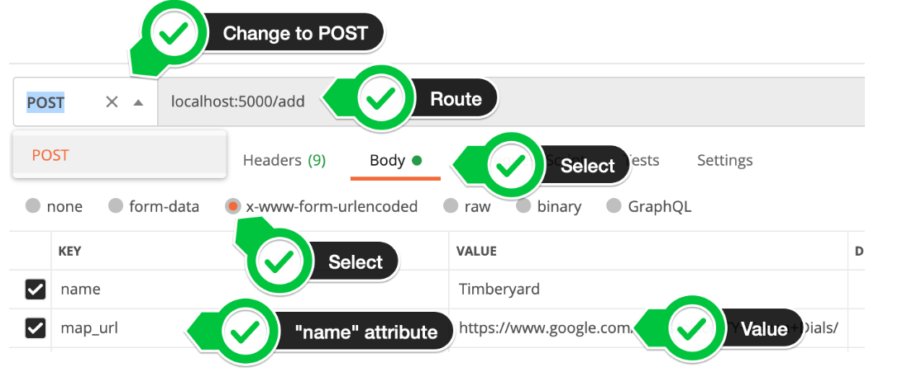

# POST

- test your API in Postman without building out a WTForm or HTML Form
- the Key-Value pairs you enter into the Body tab in Postman is equivalent to <input> elements
    - postman key = input's name attribute, postman value = the value typed into the input
