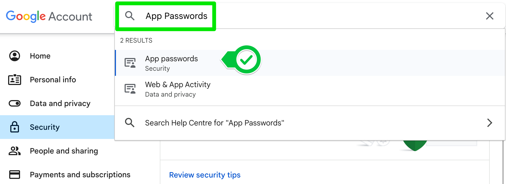
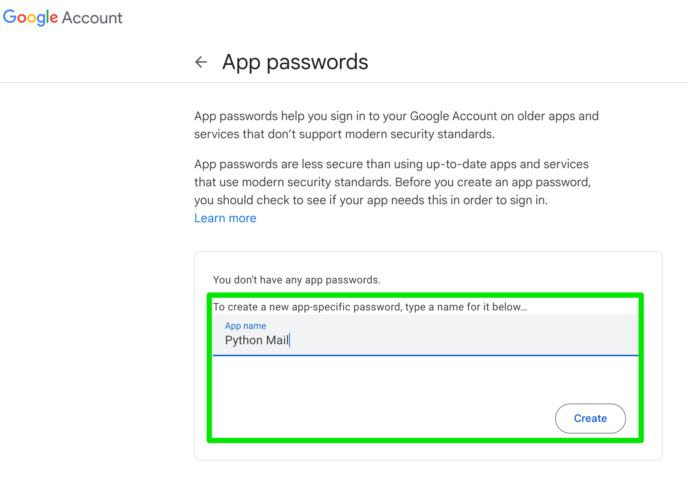

# Gettting App Passwords

# Gmail
**Below are steps specific to get app password for sending from gmail**

1. Log into your gmail account
2. Click on your profile and go to **Manage Google Account**
    - Select Security on the left
    - Scroll down to **How you sign in to Google**
    - Enable 2-Step Verification
3. Find the section on App Passwords by searching for it

4. Add an App password
    - Select give your app a name and click create. 
        
5. COPY THE PASSWORD
    - this is the only time you will ever see the password
    - it is 16 characters with no spaces
6. Use this App password in your Python code instead of your normal password

# Yahoo
**Below are steps specific to get app password for sending from yahoo**

1. Log into your yahoo account
2. Click on your profile and go to **Account Info**
    - Select Security 
    - Scroll down to **External connections**
    - Click create app password
3. Create App password
    - Select Your app, select `Other`
    - Give Your app a name
    - Click Generate
4. COPY THE PASSWORD
5. Use this App password in your Python code instead of your normal password

